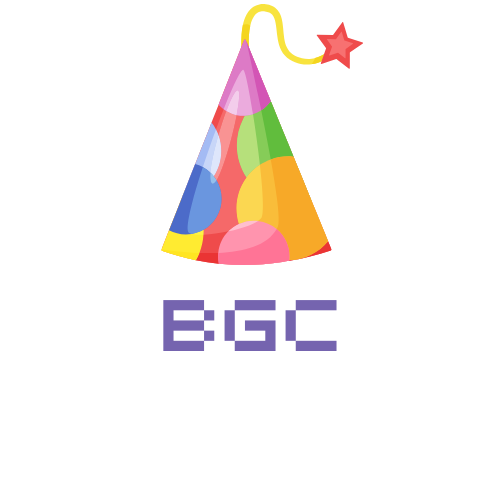

<div align="center">

# Birthday Greeting Counter



*A simple web application to keep track of birthday greetings you receive.*

[](https://wakatime.com/badge/user/a5586167-bdae-4a0c-90d2-15e75288fa41/project/caf375af-9107-4bc6-865f-0c3b23bc63b7)


</div>


## Features

- **Increment Counter**: Add to your greeting count when someone wishes you a happy birthday
- **Decrement Counter**: Remove a count in case of accidental increments
- **Save Button**: Store your current count

## Usage

1. Open the application on your birthday
2. Press the "increment" button each time someone wishes you a happy birthday
3. If you accidentally press increment, use the "decrement" button to correct the count
4. Click "Save" to store your count
5. At the end of the day, you'll have an accurate count of birthday wishes!


## Getting Started

### Prerequisites

- A modern web browser (Chrome, Firefox, Safari, Edge)

### Installation

1. Clone this repository:
   ```
   git clone https://github.com/yourusername/birthday-greeting-counter.git
   ```
2. Navigate to the project directory:
   ```
   cd birthday-greeting-counter
   ```
3. Open `index.html` in your web browser

## Development

This project uses:
- HTML5 for structure
- CSS3 for styling
- JavaScript for functionality


## Acknowledgments

- Thanks to everyone who wished me a happy birthday!
- Inspired by scrimba's passenger counter project
